# Lab7Web

# Praktikum 1 - PHP Framework CodeIgniter 4

## Nama  : Nysonnn
## Kelas : -
## Matkul: Pemrograman Web 2

---

# 📌 Tujuan Praktikum

1. Memahami konsep dasar Framework.
2. Memahami konsep MVC (Model View Controller).
3. Membuat aplikasi sederhana menggunakan Framework CodeIgniter 4.

---

# ⚙️ Persiapan

Sebelum memulai praktikum, dilakukan persiapan software dan konfigurasi environment.

## Software yang digunakan:
- XAMPP
- Visual Studio Code
- Git
- CodeIgniter 4

---

# 1️⃣ Membuat Folder Project

Membuat folder project pada direktori htdocs.

Lokasi folder:

```bash
C:\xampp\htdocs\lab11_ci
```

## Screenshot
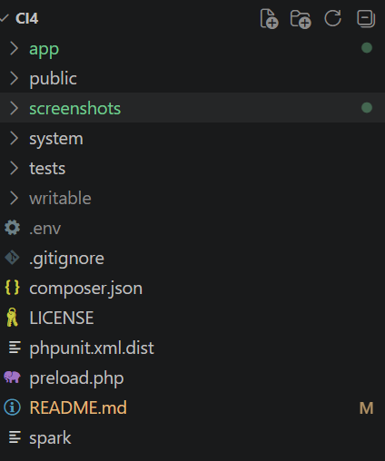

---

# 2️⃣ Install CodeIgniter 4

Download CodeIgniter 4 dari website resmi kemudian extract ke folder project.

Folder hasil extract:

```bash
C:\xampp\htdocs\lab11_ci\ci4
```

Menjalankan project menggunakan terminal:

```bash
php spark serve
```

## Screenshot
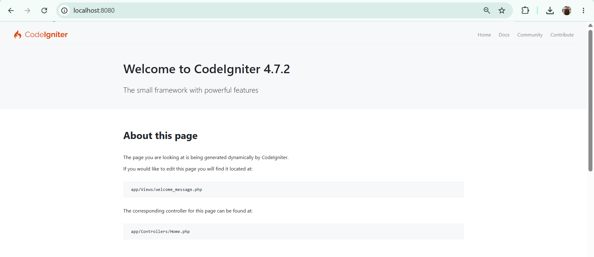

---

# 3️⃣ Mengaktifkan Extension PHP

Mengaktifkan extension pada file `php.ini`:

- intl
- mysqli
- curl
- json
- xml

Kemudian restart Apache.

## Screenshot
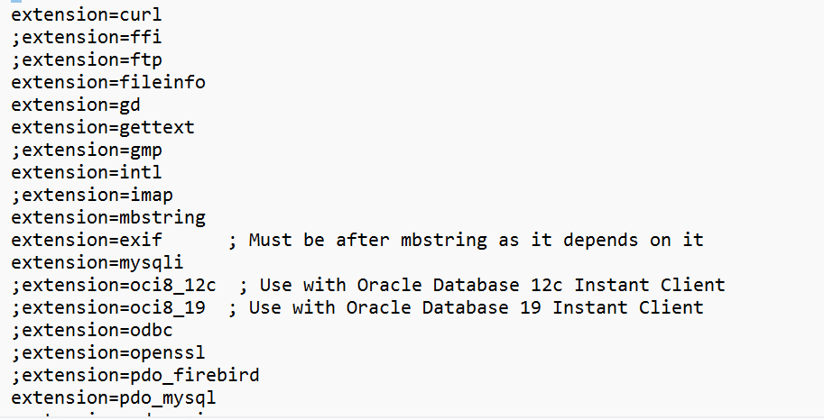

---

# 4️⃣ Menjalankan Server CodeIgniter

Menjalankan server bawaan CodeIgniter menggunakan command:

```bash
php spark serve
```

Server berjalan pada:

```bash
http://localhost:8080
```

## Screenshot
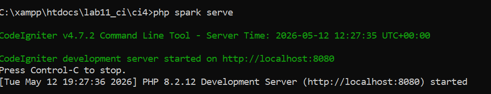

---

# 5️⃣ Membuat Routing

Routing digunakan untuk mengatur halaman yang dapat diakses.

File:

```bash
app/Config/Routes.php
```

Code:

```php
$routes->get('/about', 'Page::about');
$routes->get('/contact', 'Page::contact');
$routes->get('/faqs', 'Page::faqs');
```

## Screenshot
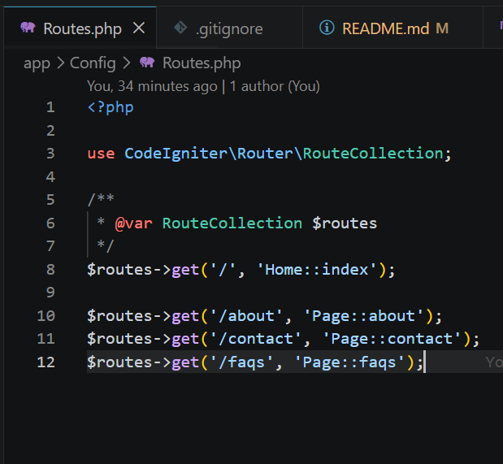

---

# 6️⃣ Membuat Controller

Membuat controller `Page.php`.

Lokasi file:

```bash
app/Controllers/Page.php
```

Controller digunakan untuk menghubungkan routing dengan tampilan halaman.

Code:

```php
<?php

namespace App\Controllers;

class Page extends BaseController
{
    public function about()
    {
        return view('about', [
            'title' => 'Halaman About',
            'content' => 'Ini adalah halaman about.'
        ]);
    }

    public function contact()
    {
        return view('contact', [
            'title' => 'Halaman Contact',
            'content' => 'Ini adalah halaman contact.'
        ]);
    }

    public function faqs()
    {
        return view('faqs', [
            'title' => 'Halaman FAQ',
            'content' => 'Ini adalah halaman FAQ.'
        ]);
    }
}
```

## Screenshot
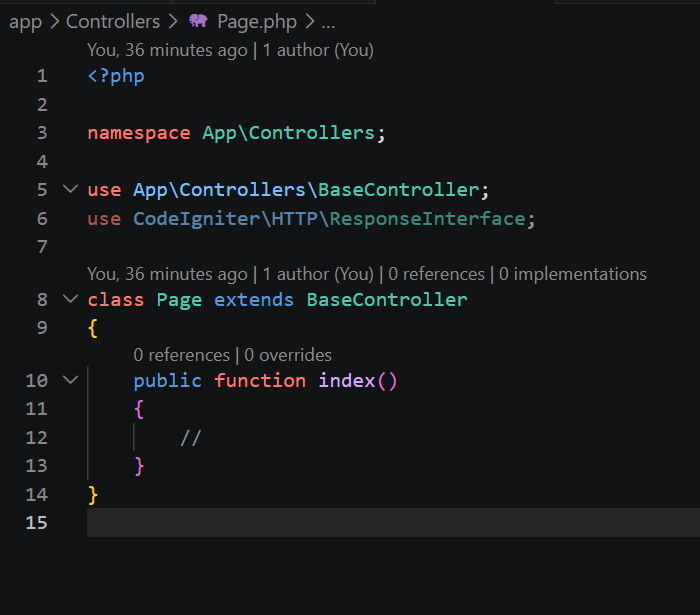

---

# 7️⃣ Membuat View

Membuat file view:
- about.php
- contact.php
- faqs.php

Lokasi:

```bash
app/Views/
```

View digunakan untuk menampilkan halaman website.

## Screenshot
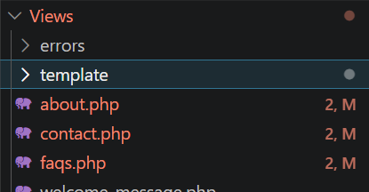

---

# 8️⃣ Membuat Layout Template

Membuat:
- header.php
- footer.php

Lokasi:

```bash
app/Views/template/
```

Template digunakan agar tampilan website lebih rapih dan konsisten.

## Screenshot
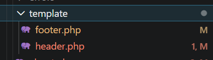

---

# 9️⃣ Membuat CSS

Membuat file CSS pada:

```bash
public/style.css
```

CSS digunakan untuk mempercantik tampilan website.

## Screenshot
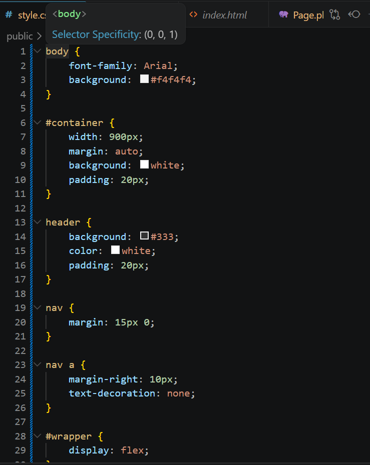

---

# 🔟 Hasil Tampilan Website

## Halaman About
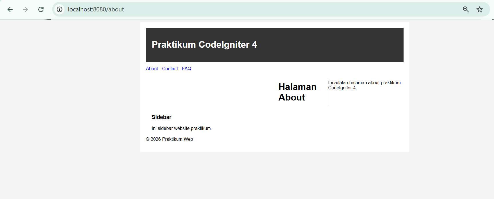

## Halaman Contact
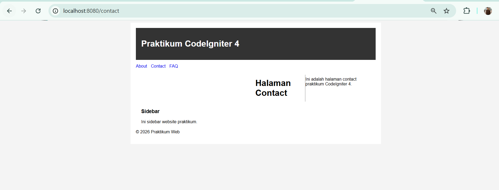

## Halaman FAQ
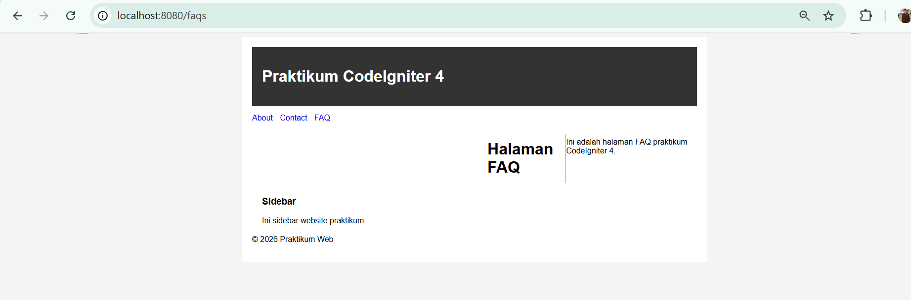

---

# 1️⃣1️⃣ Menampilkan Routes

Menjalankan perintah:

```bash
php spark routes
```

Untuk melihat daftar routing yang aktif.

## Screenshot
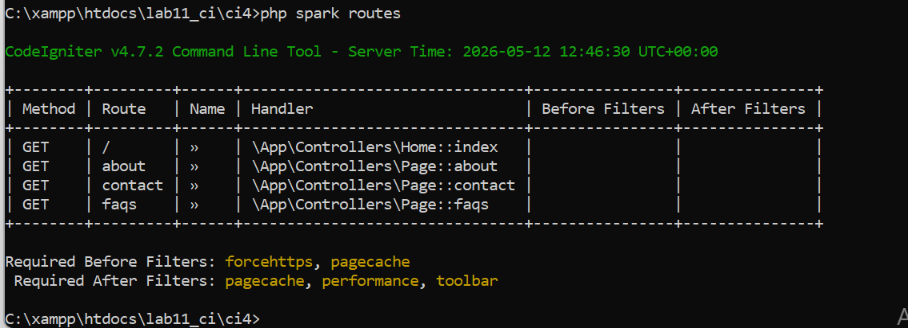

---

# ✅ Kesimpulan

Pada praktikum ini berhasil dibuat aplikasi sederhana menggunakan Framework CodeIgniter 4 dengan menerapkan konsep MVC (Model View Controller), routing, controller, view, template layout, dan CSS.

---

# 🔗 Repository GitHub

Tambahkan link repository GitHub di sini.
