# Lab7Web

# Praktikum 1 & 2 - PHP Framework CodeIgniter 4

## Nama  : Nysonnn
## Kelas : -
## Matkul: Pemrograman Web 2

---

# 📌 Tujuan Praktikum

## Praktikum 1
1. Memahami konsep dasar Framework.
2. Memahami konsep MVC (Model View Controller).
3. Membuat aplikasi sederhana menggunakan Framework CodeIgniter 4.

## Praktikum 2
1. Memahami konsep dasar Model.
2. Memahami konsep dasar CRUD.
3. Membuat aplikasi CRUD sederhana menggunakan CodeIgniter 4.

---

# ⚙️ Persiapan

Sebelum memulai praktikum, dilakukan persiapan software dan konfigurasi environment.

## Software yang digunakan:
- XAMPP
- Visual Studio Code
- Git
- CodeIgniter 4
- MySQL

---

# 🚀 Praktikum 1 - Framework CodeIgniter 4

# 1️⃣ Membuat Folder Project

Membuat folder project pada direktori htdocs.

Lokasi folder:

```bash
C:\xampp\htdocs\lab11_ci
```

## Screenshot


---

# 2️⃣ Install CodeIgniter 4

Download CodeIgniter 4 dari website resmi kemudian extract ke folder project.

Folder hasil extract:

```bash
C:\xampp\htdocs\lab11_ci\ci4
```

Menjalankan project menggunakan terminal:

```bash
php spark serve
```

## Screenshot


---

# 3️⃣ Mengaktifkan Extension PHP

Mengaktifkan extension pada file `php.ini`:

- intl
- mysqli
- curl
- json
- xml

Kemudian restart Apache.

## Screenshot


---

# 4️⃣ Menjalankan Server CodeIgniter

Menjalankan server bawaan CodeIgniter menggunakan command:

```bash
php spark serve
```

Server berjalan pada:

```bash
http://localhost:8080
```

## Screenshot


---

# 5️⃣ Membuat Routing

Routing digunakan untuk mengatur halaman yang dapat diakses.

File:

```bash
app/Config/Routes.php
```

Code:

```php
$routes->get('/about', 'Page::about');
$routes->get('/contact', 'Page::contact');
$routes->get('/faqs', 'Page::faqs');
```

## Screenshot


---

# 6️⃣ Membuat Controller

Membuat controller `Page.php`.

Lokasi file:

```bash
app/Controllers/Page.php
```

Controller digunakan untuk menghubungkan routing dengan tampilan halaman.

## Screenshot


---

# 7️⃣ Membuat View

Membuat file view:
- about.php
- contact.php
- faqs.php

Lokasi:

```bash
app/Views/
```

View digunakan untuk menampilkan halaman website.

## Screenshot


---

# 8️⃣ Membuat Layout Template

Membuat:
- header.php
- footer.php

Lokasi:

```bash
app/Views/template/
```

Template digunakan agar tampilan website lebih rapih dan konsisten.

## Screenshot


---

# 9️⃣ Membuat CSS

Membuat file CSS pada:

```bash
public/style.css
```

CSS digunakan untuk mempercantik tampilan website.

## Screenshot


---

# 🔟 Hasil Tampilan Website

## Halaman About


## Halaman Contact


## Halaman FAQ


---

# 1️⃣1️⃣ Menampilkan Routes

Menjalankan perintah:

```bash
php spark routes
```

Untuk melihat daftar routing yang aktif.

## Screenshot


---

# 🚀 Praktikum 2 - CRUD Artikel

# 1️⃣ Membuat Database

Membuat database baru menggunakan MySQL.

SQL:

```sql
CREATE DATABASE lab_ci4;
```

## Screenshot
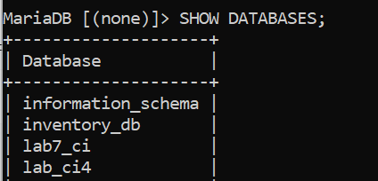

---

# 2️⃣ Membuat Tabel Artikel

Membuat tabel artikel untuk menyimpan data artikel.

SQL:

```sql
CREATE TABLE artikel (
    id INT(11) auto_increment,
    judul VARCHAR(200) NOT NULL,
    isi TEXT,
    gambar VARCHAR(200),
    status TINYINT(1) DEFAULT 0,
    slug VARCHAR(200),
    PRIMARY KEY(id)
);
```

## Screenshot
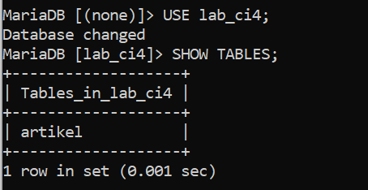

---

# 3️⃣ Menambahkan Data Artikel

Menambahkan data artikel awal ke database.

SQL:

```sql
INSERT INTO artikel (judul, isi, slug) VALUES
(
'Artikel Pertama',
'Ini isi artikel pertama praktikum CodeIgniter 4',
'artikel-pertama'
),
(
'Artikel Kedua',
'Ini isi artikel kedua praktikum CodeIgniter 4',
'artikel-kedua'
);
```

## Screenshot
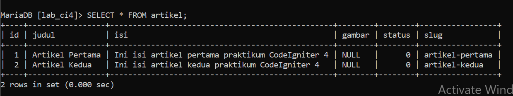

---

# 4️⃣ Konfigurasi Database

Melakukan konfigurasi database pada file `.env`.

Code:

```ini
database.default.hostname = localhost
database.default.database = lab_ci4
database.default.username = root
database.default.password =
database.default.DBDriver = MySQLi
database.default.port = 3306
```

## Screenshot
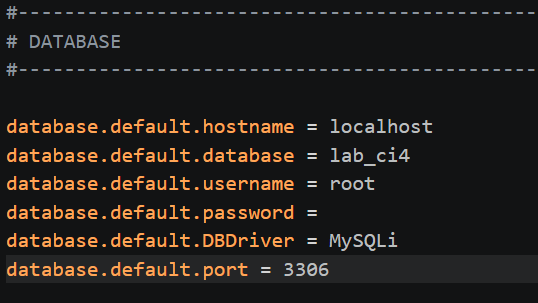

---

# 5️⃣ Membuat Model

Membuat model `ArtikelModel.php`.

Lokasi:

```bash
app/Models/ArtikelModel.php
```

Model digunakan untuk menghubungkan aplikasi dengan database.

## Screenshot
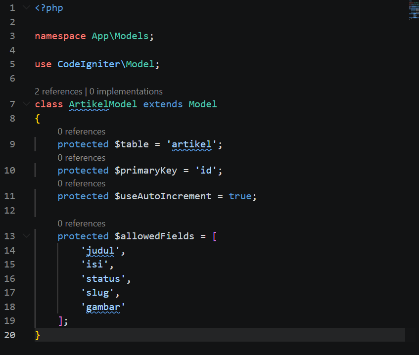

---

# 6️⃣ Membuat Controller Artikel

Membuat controller `Artikel.php`.

Lokasi:

```bash
app/Controllers/Artikel.php
```

Controller digunakan untuk mengambil data artikel dari database.

## Screenshot
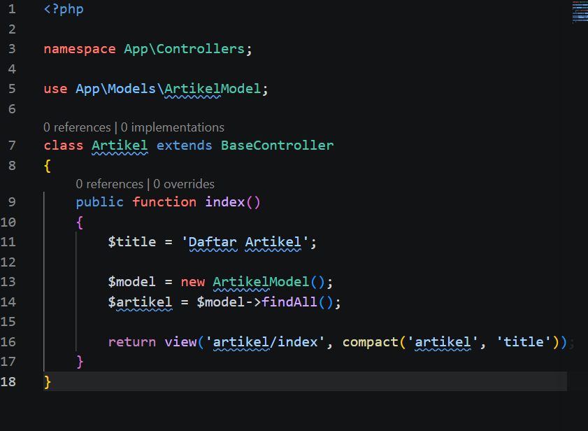

---

# 7️⃣ Membuat View Artikel

Membuat halaman tampilan artikel.

Lokasi:

```bash
app/Views/artikel/index.php
```

View digunakan untuk menampilkan data artikel dari database.

## Screenshot
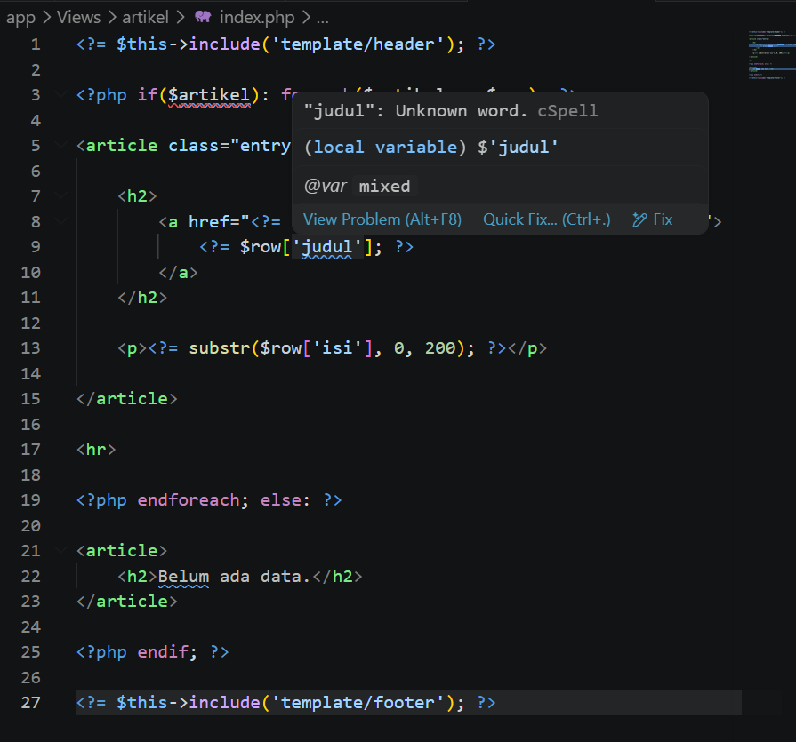

---

# 8️⃣ Menambahkan Routing Artikel

Menambahkan route untuk halaman artikel.

Code:

```php
$routes->get('/artikel', 'Artikel::index');
```

## Screenshot


---

# 9️⃣ Menampilkan Halaman Artikel

Menjalankan halaman artikel pada browser:

```bash
http://localhost:8080/artikel
```

Data artikel berhasil tampil dari database MySQL.

## Screenshot
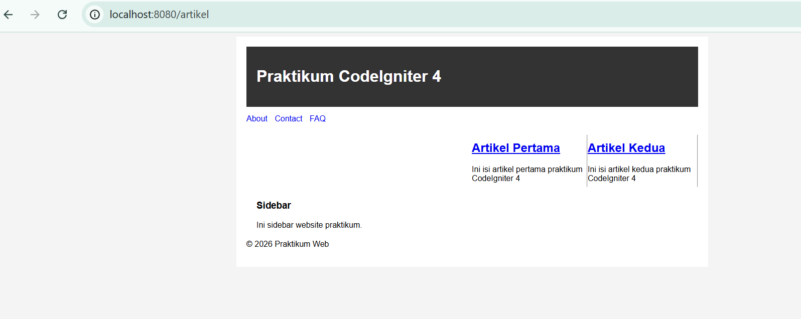

---

# 🔟 Menjalankan PHP Spark Routes

Menampilkan daftar route aktif menggunakan command:

```bash
php spark routes
```

## Screenshot


---

# ✅ Kesimpulan

Pada praktikum ini berhasil dibuat aplikasi sederhana menggunakan Framework CodeIgniter 4 dengan menerapkan:
- MVC (Model View Controller)
- Routing
- Controller
- View
- Template Layout
- CSS
- CRUD sederhana
- Koneksi Database MySQL

---

---

# 🚀 Praktikum 3 - View Layout dan View Cell

# 1️⃣ Membuat Layout Utama

Membuat folder layout pada direktori:

```bash
app/Views/layout
```

Kemudian membuat file:

```bash
main.php
```

Layout digunakan sebagai template utama agar tampilan website lebih rapih dan dapat digunakan ulang pada banyak halaman.

## Screenshot
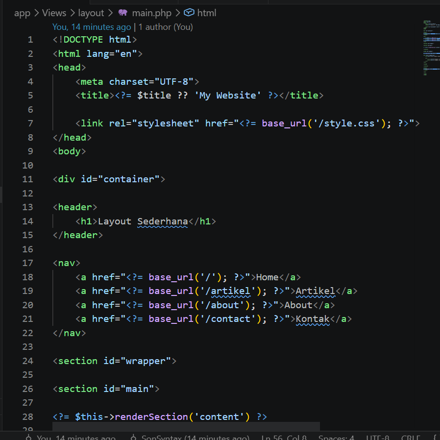

---

# 2️⃣ Mengubah View Menggunakan Layout

Mengubah file view agar menggunakan layout baru dengan method:

```php
<?= $this->extend('layout/main') ?>
```

dan:

```php
<?= $this->section('content') ?>
```

View yang diubah:
- about.php
- contact.php
- faqs.php

## Screenshot
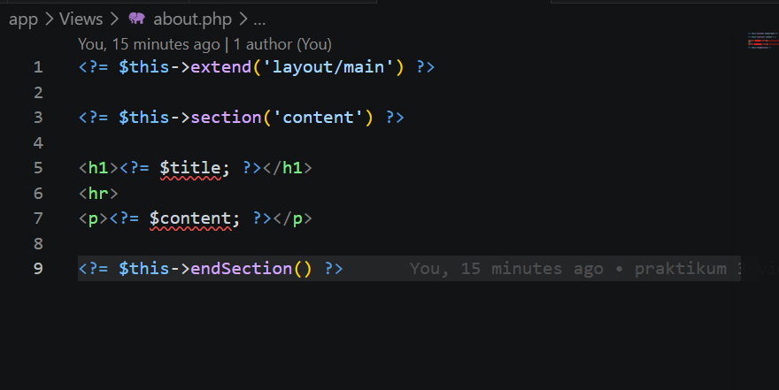

---

# 3️⃣ Membuat View Cell

Membuat folder:

```bash
app/Cells
```

Kemudian membuat file:

```bash
ArtikelTerkini.php
```

View Cell digunakan untuk membuat komponen yang dapat digunakan ulang seperti sidebar dan widget artikel terbaru.

## Screenshot
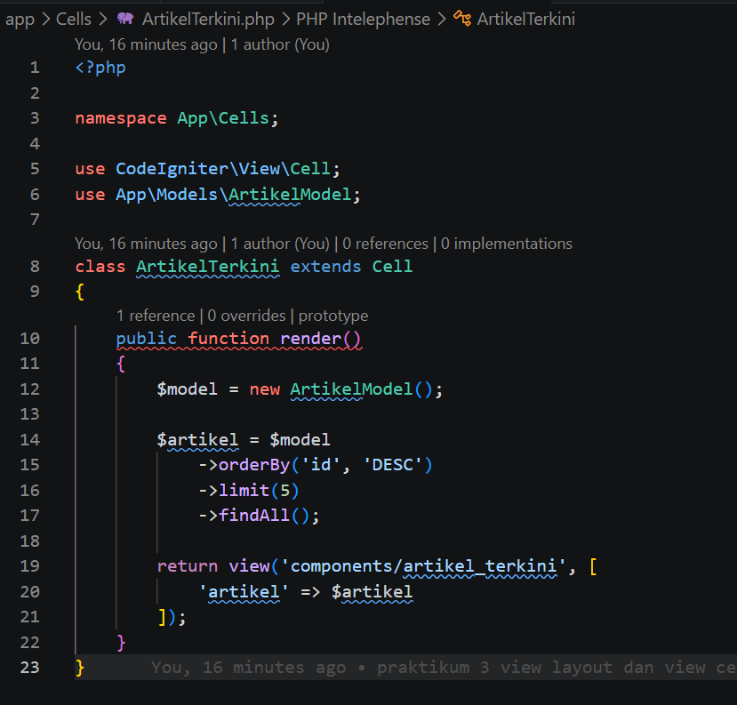

---

# 4️⃣ Membuat View Components

Membuat folder:

```bash
app/Views/components
```

Kemudian membuat file:

```bash
artikel_terkini.php
```

View component digunakan untuk menampilkan daftar artikel terbaru pada sidebar.

## Screenshot
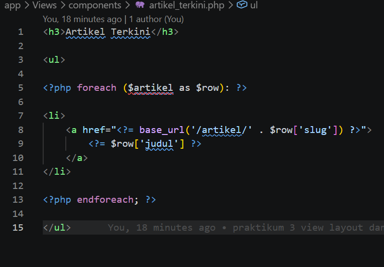

---

# 5️⃣ Menampilkan Layout Website

Menjalankan website menggunakan layout baru yang sudah menggunakan:
- Navbar
- Sidebar
- Widget
- Artikel terbaru

URL:

```bash
http://localhost:8080/about
```

## Screenshot
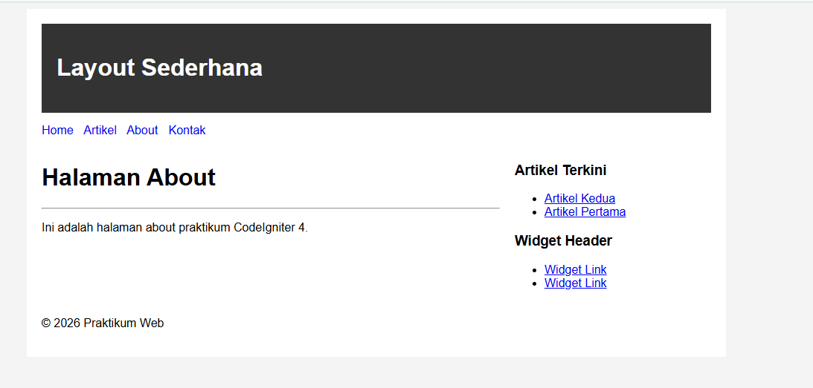

---

# 6️⃣ Menampilkan Sidebar Widget

Sidebar menampilkan:
- Artikel terbaru
- Widget link
- Widget text

## Screenshot
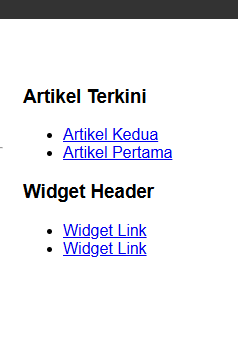

---

# 7️⃣ Menjalankan PHP Spark Serve

Menjalankan server CodeIgniter menggunakan command:

```bash
php spark serve
```

## Screenshot


---

# 8️⃣ Menampilkan Routes

Menampilkan route aktif menggunakan command:

```bash
php spark routes
```

## Screenshot
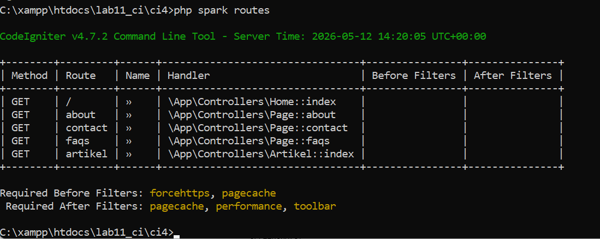

---

# 📌 Jawaban Pertanyaan Praktikum

## 1. Apa manfaat utama dari penggunaan View Layout?

View Layout mempermudah pengelolaan tampilan website karena template utama cukup dibuat satu kali dan dapat digunakan ulang pada banyak halaman sehingga kode menjadi lebih rapih dan efisien.

---

## 2. Jelaskan perbedaan antara View Cell dan View biasa.

- View biasa digunakan untuk menampilkan halaman utama website.
- View Cell digunakan untuk membuat komponen kecil yang reusable seperti sidebar, widget, menu, dan artikel terbaru.

---

## 3. Ubah View Cell agar hanya menampilkan post dengan kategori tertentu.

Contoh query:

```php
$model->where('kategori', 'Teknologi')->findAll();
```

Dengan query tersebut View Cell hanya akan menampilkan artikel berdasarkan kategori tertentu.

---

---

# 🚀 Praktikum 4 - Modul Login dan Auth Filter

# 1️⃣ Membuat Tabel User

Membuat tabel user untuk menyimpan data login administrator.

SQL:

```sql
CREATE TABLE user (
    id INT(11) auto_increment,
    username VARCHAR(200) NOT NULL,
    useremail VARCHAR(200),
    userpassword VARCHAR(200),
    PRIMARY KEY(id)
);
```

## Screenshot
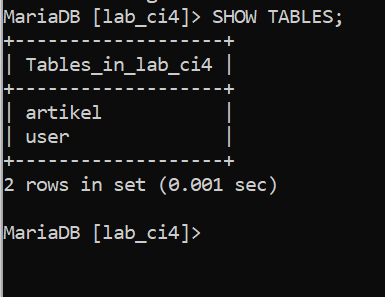

---

# 2️⃣ Membuat User Model

Membuat file model:

```bash
app/Models/UserModel.php
```

Model digunakan untuk menghubungkan data user dengan database.

## Screenshot
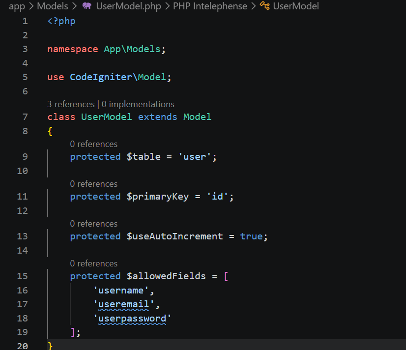

---

# 3️⃣ Membuat Controller User

Membuat controller:

```bash
app/Controllers/User.php
```

Controller digunakan untuk:
- proses login
- validasi user
- membuat session login
- logout

## Screenshot
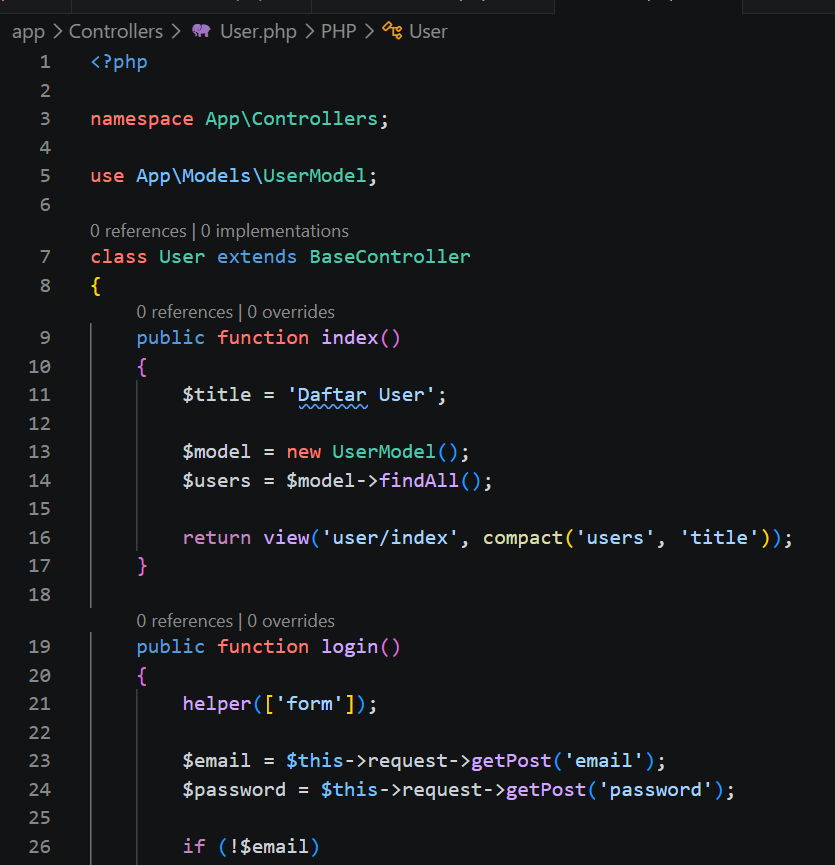

---

# 4️⃣ Membuat View Login

Membuat halaman login:

```bash
app/Views/user/login.php
```

Halaman login digunakan untuk autentikasi user sebelum masuk ke halaman admin.

## Screenshot
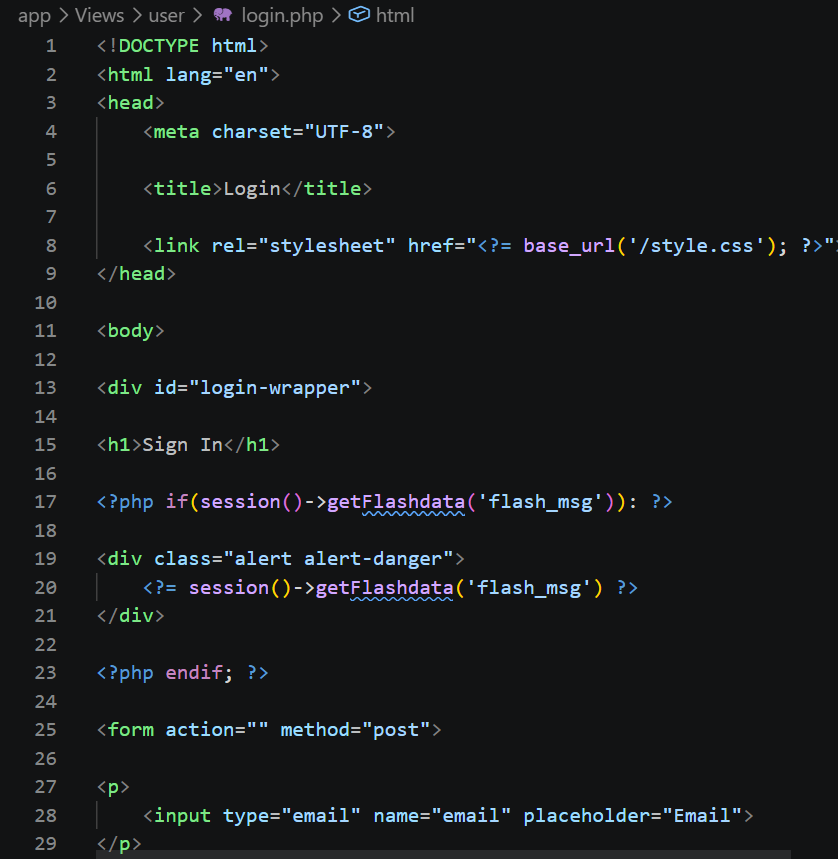

---

# 5️⃣ Membuat Database Seeder

Membuat seeder untuk memasukkan akun admin secara otomatis.

Command:

```bash
php spark make:seeder UserSeeder
```

Seeder digunakan untuk membuat data dummy login administrator.

## Screenshot
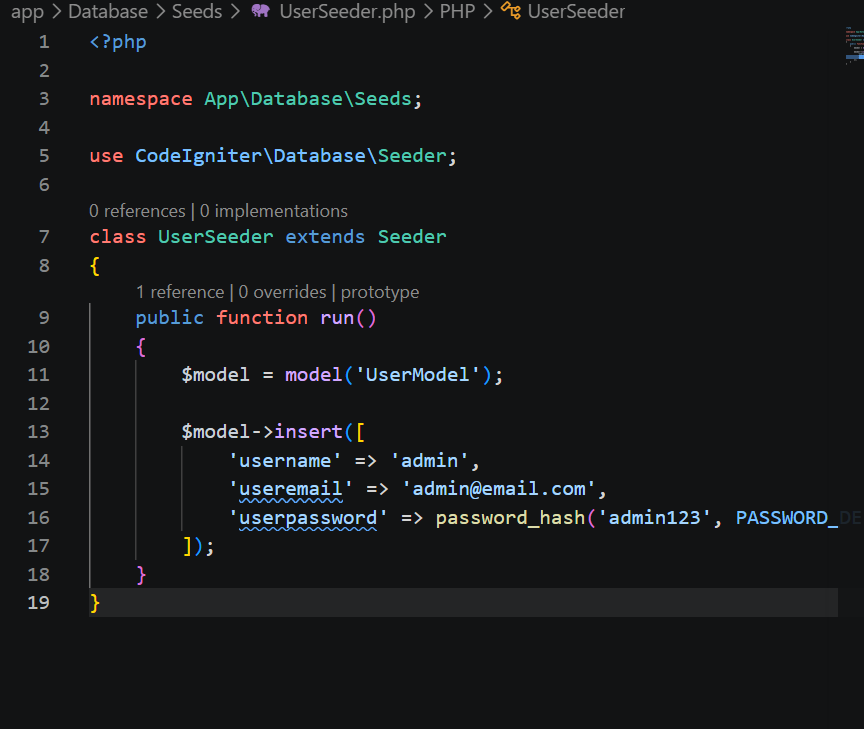

---

# 6️⃣ Menjalankan Seeder

Menjalankan seeder menggunakan command:

```bash
php spark db:seed UserSeeder
```

Data admin berhasil masuk ke database.

## Screenshot
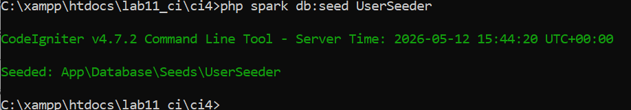

---

# 7️⃣ Membuat Auth Filter

Membuat file filter:

```bash
app/Filters/Auth.php
```

Filter digunakan untuk melindungi halaman admin agar hanya dapat diakses setelah login.

## Screenshot
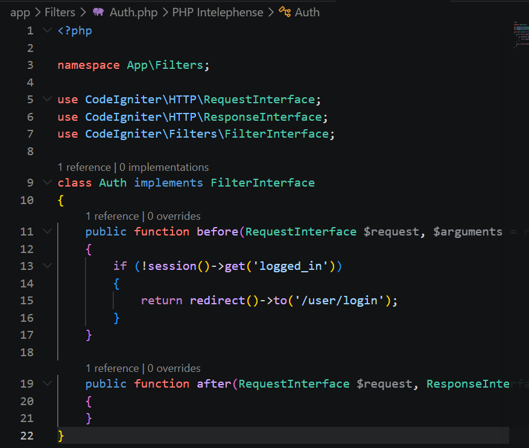

---

# 8️⃣ Menambahkan Config Filter

Menambahkan auth filter pada file:

```bash
app/Config/Filters.php
```

Code:

```php
'auth' => \App\Filters\Auth::class,
```

## Screenshot
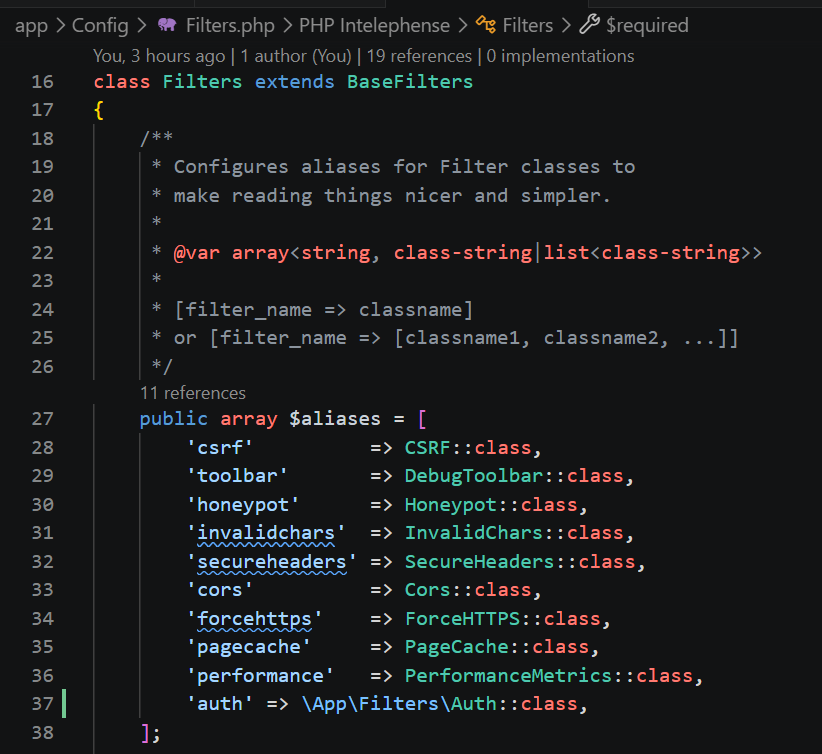

---

# 9️⃣ Menambahkan Routes Login

Menambahkan route login dan logout pada file:

```bash
app/Config/Routes.php
```

Code:

```php
$routes->match(['get', 'post'], 'user/login', 'User::login');

$routes->get('user/logout', 'User::logout');
```

Serta menambahkan proteksi auth filter pada halaman admin.

## Screenshot
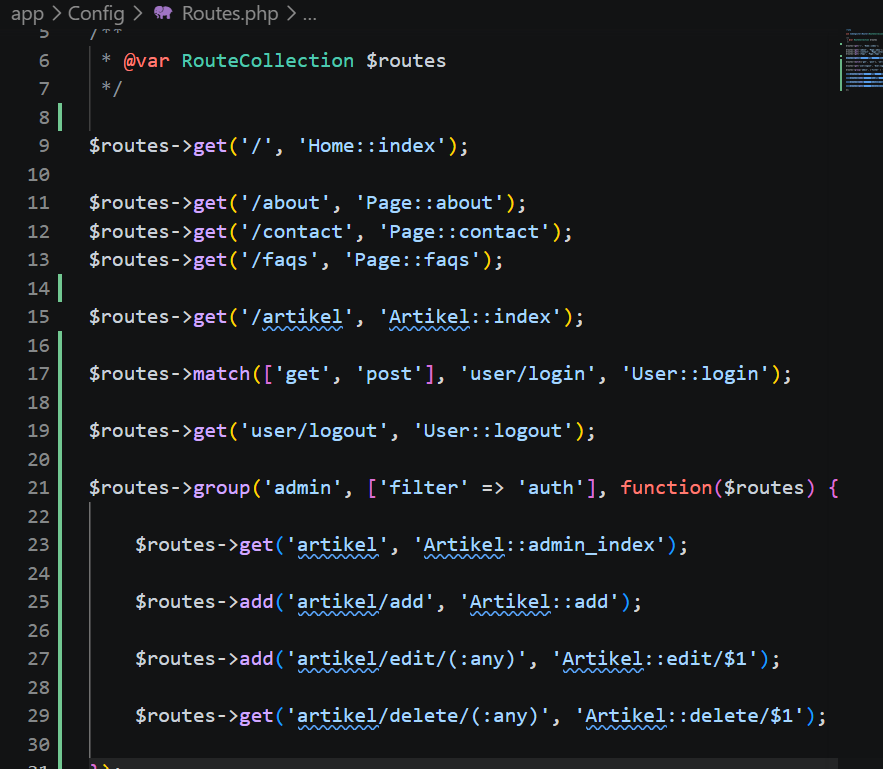

---

# 🔟 Menampilkan Halaman Login

Menjalankan halaman login pada browser:

```bash
http://localhost:8080/user/login
```

## Screenshot
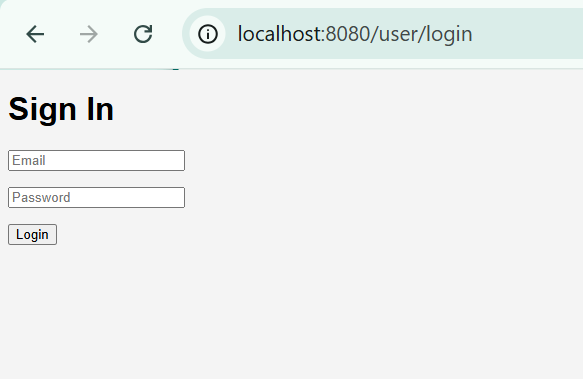

---

# 1️⃣1️⃣ Login Berhasil

Melakukan login menggunakan akun administrator:

Email:

```bash
admin@email.com
```

Password:

```bash
admin123
```

Setelah login berhasil maka user diarahkan ke halaman admin artikel.

## Screenshot
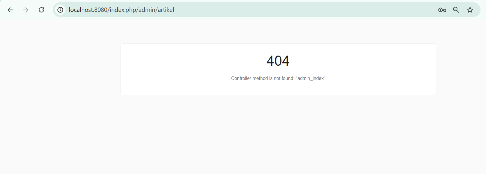

---

# 1️⃣2️⃣ Redirect Login

Ketika user belum login dan mencoba mengakses halaman admin:

```bash
http://localhost:8080/admin/artikel
```

maka sistem otomatis redirect ke halaman login.

## Screenshot
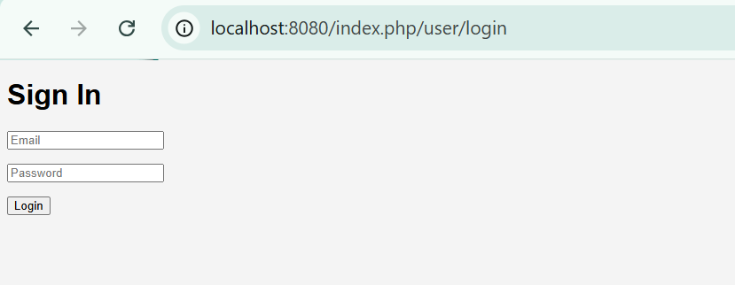

---

# ✅ Kesimpulan Praktikum 4

Pada praktikum ini berhasil dibuat:
- Sistem Login
- Session Login
- Logout
- Auth Filter
- Redirect Login
- Proteksi halaman admin menggunakan filter authentication

Dengan demikian halaman admin menjadi lebih aman karena hanya dapat diakses oleh user yang sudah login.

---

---

# 🚀 Praktikum 5 - Pagination dan Pencarian

# 📌 Tujuan Praktikum

1. Memahami konsep dasar Pagination.
2. Memahami konsep dasar Pencarian.
3. Membuat fitur Pagination dan Pencarian menggunakan Framework CodeIgniter 4.

---

# 1️⃣ Membuat Method Admin Index

Membuka file controller:

```bash
app/Controllers/Artikel.php
```

Kemudian menambahkan method:

```php
public function admin_index()
{
    $title = 'Daftar Artikel';

    $q = $this->request->getVar('q') ?? '';

    $model = new ArtikelModel();

    $data = [
        'title'   => $title,
        'q'       => $q,
        'artikel' => $model->like('judul', $q)->paginate(10),
        'pager'   => $model->pager,
    ];

    return view('artikel/admin_index', $data);
}
```

Method ini digunakan untuk:
- menampilkan data artikel
- membuat pagination
- membuat pencarian artikel

## Screenshot
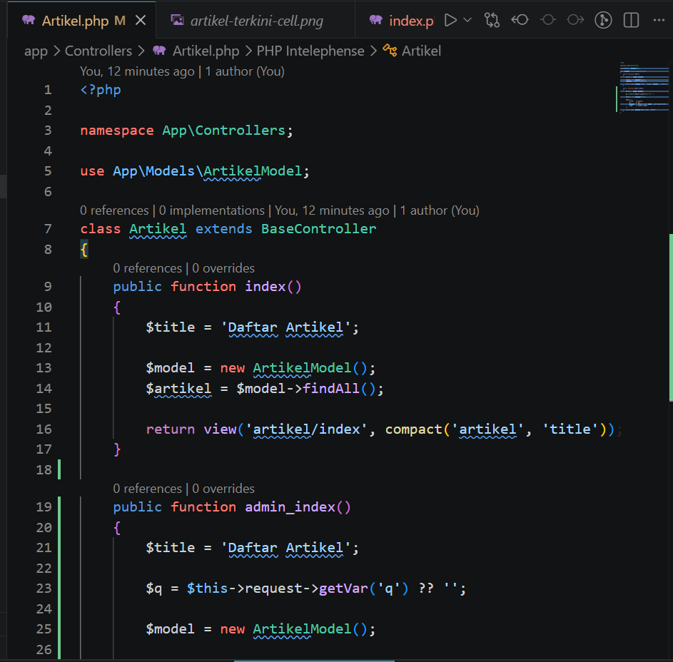

---

# 2️⃣ Membuat Halaman Admin Artikel

Membuat file:

```bash
app/Views/artikel/admin_index.php
```

Halaman ini digunakan untuk:
- menampilkan tabel artikel
- menampilkan form pencarian
- menampilkan tombol edit dan hapus

## Screenshot
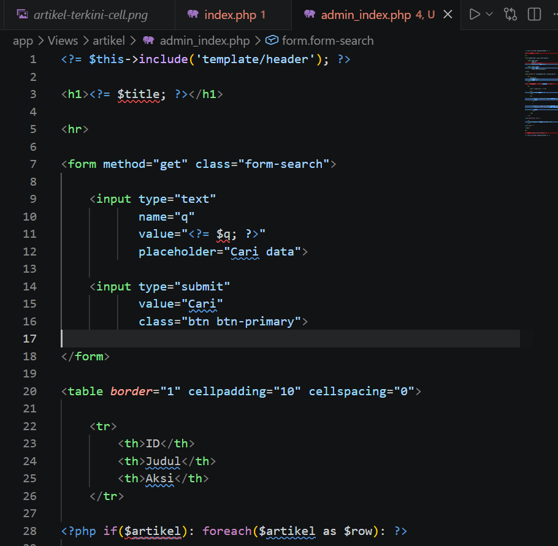

---

# 3️⃣ Membuat Form Pencarian

Menambahkan form pencarian pada halaman admin artikel.

Code:

```php
<form method="get" class="form-search">

    <input type="text"
           name="q"
           value="<?= $q; ?>"
           placeholder="Cari data">

    <input type="submit"
           value="Cari"
           class="btn btn-primary">

</form>
```

Form digunakan untuk mencari artikel berdasarkan judul.

## Screenshot
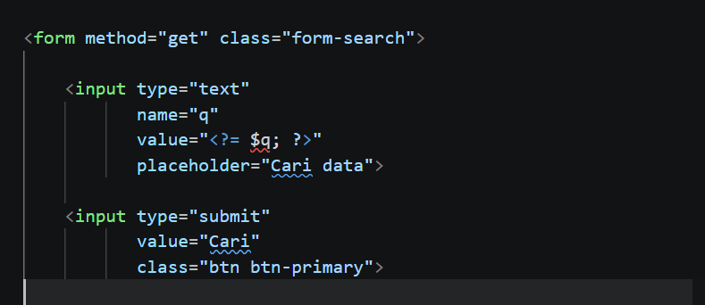

---

# 4️⃣ Membuat Pagination

Menambahkan pagination pada halaman admin artikel.

Code:

```php
<?= $pager->only(['q'])->links(); ?>
```

Pagination digunakan untuk membatasi jumlah data artikel per halaman.

## Screenshot
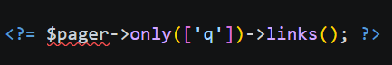

---

# 5️⃣ Menambahkan Data Artikel

Menambahkan banyak data artikel pada database untuk menguji pagination.

Contoh SQL:

```sql
INSERT INTO artikel (judul, isi, slug)
VALUES
('Artikel 3','Isi artikel 3','artikel-3'),
('Artikel 4','Isi artikel 4','artikel-4'),
('Artikel 5','Isi artikel 5','artikel-5');
```

## Screenshot
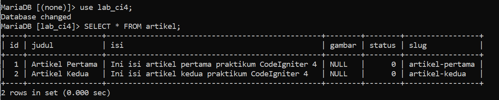

---

# 6️⃣ Menampilkan Halaman Pagination

Menjalankan halaman admin artikel:

```bash
http://localhost:8080/admin/artikel
```

Pagination berhasil tampil dan data artikel dibagi menjadi beberapa halaman.

## Screenshot
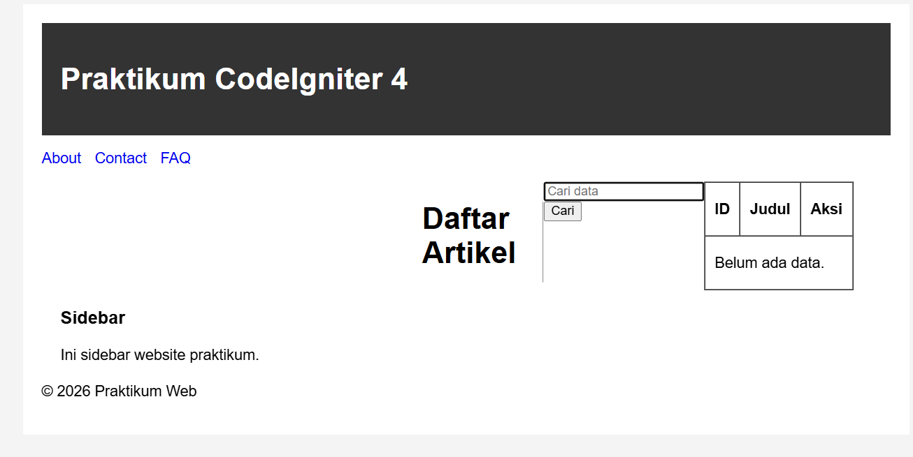

---

# 7️⃣ Menampilkan Hasil Pencarian

Melakukan pencarian artikel menggunakan keyword tertentu pada form pencarian.

Data artikel berhasil difilter sesuai kata kunci yang dimasukkan.

## Screenshot
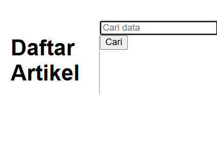

---

# 8️⃣ Menjalankan PHP Spark Serve

Menjalankan server CodeIgniter menggunakan command:

```bash
php spark serve
```

## Screenshot
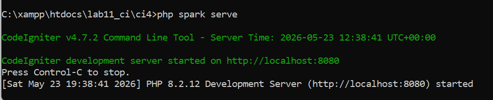

---

# ✅ Kesimpulan Praktikum 5

Pada praktikum ini berhasil dibuat:
- Pagination data artikel
- Pencarian artikel
- Filter data menggunakan keyword
- Pembagian halaman otomatis menggunakan Pager CodeIgniter 4

Dengan demikian tampilan data menjadi lebih rapih, efisien, dan mudah digunakan ketika jumlah data semakin banyak.

---

# 2️⃣ Membuat Model Kategori

Model baru dibuat pada:

```bash
app/Models/KategoriModel.php
```

Field yang dapat disimpan melalui model adalah `nama_kategori` dan `slug_kategori`.

---

# 3️⃣ Memodifikasi Model Artikel

Field `id_kategori` ditambahkan ke `$allowedFields`. Model artikel juga memiliki method
untuk mengambil artikel beserta kategorinya:

```php
public function getArtikelDenganKategori(?string $slugKategori = null): array
{
    $this->select('artikel.*, kategori.nama_kategori, kategori.slug_kategori')
        ->join('kategori', 'kategori.id_kategori = artikel.id_kategori', 'left')
        ->orderBy('artikel.id', 'DESC');

    if ($slugKategori !== null) {
        $this->where('kategori.slug_kategori', $slugKategori);
    }

    return $this->findAll();
}
```

`LEFT JOIN` digunakan agar artikel tetap dapat ditampilkan meskipun kategorinya belum diisi.

---

# 4️⃣ Menambahkan Seeder Kategori dan Artikel

Seeder berikut menyediakan tiga kategori serta data artikel untuk pengujian:

```bash
app/Database/Seeds/KategoriArtikelSeeder.php
```

Menjalankan seeder:

```bash
php spark db:seed KategoriArtikelSeeder
```

Kategori yang dibuat adalah **Teknologi**, **Pemrograman**, dan **Pendidikan**.

---

# 5️⃣ Memodifikasi Controller Artikel

Controller `Artikel` diperbarui untuk menangani:

- daftar artikel beserta nama kategori;
- filter judul dan kategori pada halaman admin;
- pagination dengan parameter filter tetap tersimpan;
- tambah, edit, dan hapus artikel;
- halaman detail yang menampilkan nama kategori;
- daftar artikel berdasarkan kategori tertentu.

Query admin dibangun menggunakan `select()`, `join()`, `like()`, `where()`, dan
`paginate()` dari CodeIgniter 4 Query Builder.

---

# 6️⃣ Membuat Filter Kategori di Halaman Admin

Form admin memiliki input pencarian dan dropdown kategori. Parameter keduanya tetap
dibawa saat pengguna berpindah halaman:

```php
<?= $pager->only(['q', 'kategori_id'])->links('artikel'); ?>
```

## Screenshot

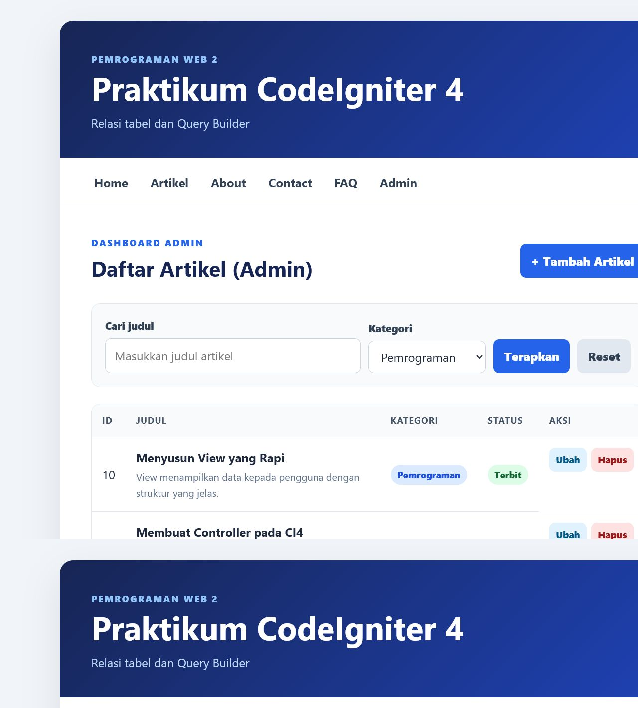

---

# 7️⃣ Menampilkan Kategori pada Halaman Artikel

Halaman publik menampilkan badge kategori pada setiap artikel dan tombol filter untuk
membuka artikel berdasarkan kategori.

Route tambahan:

```php
$routes->get('/kategori/(:segment)', 'Artikel::kategori/$1');
```

## Screenshot

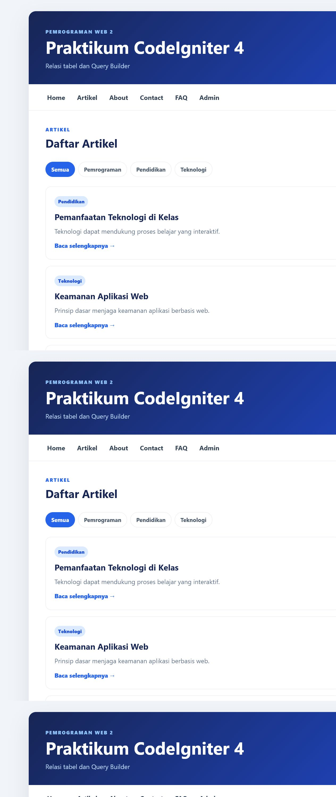

---

# 8️⃣ Membuat Form Tambah, Edit, dan Detail Artikel

View berikut ditambahkan:

```text
app/Views/artikel/form_add.php
app/Views/artikel/form_edit.php
app/Views/artikel/detail.php
```

Form tambah dan edit menyediakan pilihan kategori serta status artikel. Halaman detail
menampilkan nama kategori dari hasil join tabel.

---

# 9️⃣ Hasil Pengujian

Pengujian dilakukan pada server lokal CodeIgniter 4 dan database MySQL `lab_ci4`.

| Fitur | Hasil |
|---|---|
| Login admin | Berhasil |
| Menampilkan artikel dan kategori | Berhasil |
| Pencarian dan filter kategori | Berhasil |
| Pagination | Berhasil |
| Tambah artikel | Berhasil |
| Edit artikel dan ganti kategori | Berhasil |
| Detail artikel berkategori | Berhasil |
| Hapus artikel | Berhasil |

Semua endpoint yang diuji memberikan respons HTTP `200`, dan hasil operasi CRUD telah
diverifikasi langsung pada database.

---

# ✅ Kesimpulan Praktikum 6

Pada praktikum ini berhasil dibuat relasi One-to-Many antara tabel `kategori` dan
`artikel`. Data dari kedua tabel dapat digabungkan dengan Query Builder, kemudian
ditampilkan pada halaman publik dan admin. Fitur pencarian, filter kategori, pagination,
CRUD, detail artikel, dan daftar artikel per kategori juga telah berjalan dengan baik.

---

1. Memahami konsep dasar file upload pada aplikasi web.
2. Membuat fitur upload gambar menggunakan CodeIgniter 4.
3. Memvalidasi file gambar sebelum disimpan.
4. Menampilkan gambar pada daftar dan detail artikel.

---

# 1️⃣ Menyiapkan Folder Upload

Folder berikut digunakan untuk menyimpan gambar artikel:

```bash
public/gambar
```

File `.gitignore` disimpan di dalam folder agar direktori tetap tersedia setelah project
di-clone, sedangkan file upload pengguna tidak ikut masuk ke repository.

---

# 2️⃣ Menambahkan Validasi Gambar

Method `add()` pada controller `Artikel` ditambahkan aturan validasi berikut:

```php
'gambar' => 'uploaded[gambar]
    |is_image[gambar]
    |mime_in[gambar,image/jpg,image/jpeg,image/png,image/gif,image/webp]
    |max_size[gambar,2048]',
```

Validasi memastikan file wajib diunggah, benar-benar berupa gambar, memiliki format yang
diizinkan, dan ukurannya tidak lebih dari 2 MB.

---

# 3️⃣ Menyimpan File dengan Nama Acak

File yang lolos validasi dipindahkan ke folder `public/gambar`. Nama file dibuat secara
acak agar tidak menimpa gambar lain dan tidak menggunakan nama asli dari pengguna.

```php
$fileName = $file->getRandomName();
$file->move(FCPATH . 'gambar', $fileName);
```

Nama tersebut kemudian disimpan pada kolom `gambar` di tabel `artikel`.

---

# 4️⃣ Menambahkan Input File pada Form

Tag form tambah artikel diubah agar mendukung pengiriman file:

```php
<form action="" method="post" enctype="multipart/form-data">
```

Field gambar yang ditambahkan:

```php
<input type="file"
       name="gambar"
       id="gambar"
       accept="image/png,image/jpeg,image/gif,image/webp"
       required>
```

## Screenshot

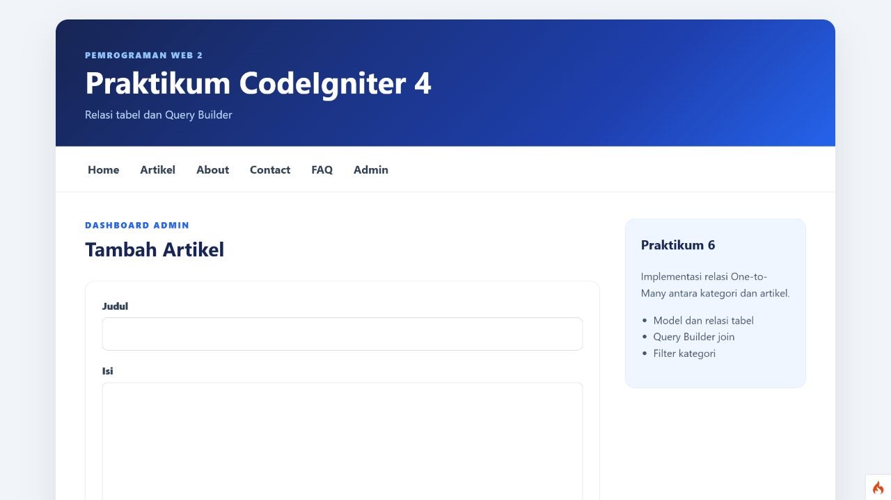

---

# 5️⃣ Mengganti Gambar Saat Edit Artikel

Form edit artikel juga menggunakan `multipart/form-data`. Upload gambar pada form edit
bersifat opsional:

- jika tidak memilih file baru, gambar lama tetap digunakan;
- jika memilih gambar baru, file baru divalidasi dan disimpan;
- setelah update berhasil, file gambar lama otomatis dihapus.

Preview gambar lama ditampilkan agar administrator dapat melihat gambar yang sedang
digunakan.

---

# 6️⃣ Menghapus File Bersama Artikel

Method `delete()` diperbarui agar gambar pada folder `public/gambar` ikut dihapus setelah
record artikel berhasil dihapus. Nama file diamankan menggunakan `basename()` sebelum
diakses dari filesystem.

---

# 7️⃣ Menampilkan Gambar Artikel

View daftar artikel dan detail artikel menampilkan gambar dari folder publik:

```php
"
     alt="<?= esc($artikel['judul']); ?>">
```

## Screenshot

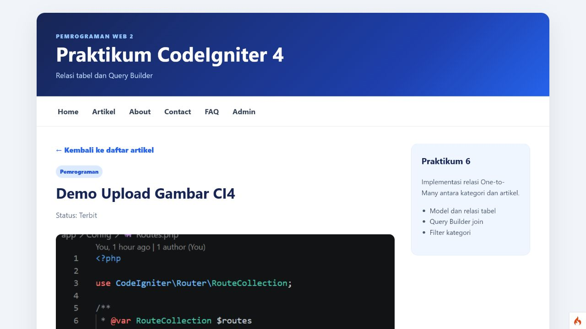

---

# 8️⃣ Hasil Pengujian

| Pengujian | Hasil |
|---|---|
| File teks/non-gambar ditolak | Berhasil |
| Gambar PNG valid disimpan | Berhasil |
| Nama file dibuat acak | Berhasil |
| Nama file tersimpan di database | Berhasil |
| Gambar tampil pada detail artikel | Berhasil |
| Gambar dapat diganti saat edit | Berhasil |
| File gambar lama terhapus setelah diganti | Berhasil |
| File gambar terhapus bersama artikel | Berhasil |

Pengujian dilakukan melalui request `multipart/form-data` pada server lokal dan hasilnya
diverifikasi langsung pada database serta folder `public/gambar`.

---

# ✅ Kesimpulan Praktikum 7

Pada praktikum ini berhasil dibuat fitur upload gambar artikel menggunakan CodeIgniter 4.
File gambar divalidasi berdasarkan tipe MIME, ekstensi gambar, dan ukuran maksimal. File
disimpan menggunakan nama acak, dapat diganti pada proses edit, ditampilkan pada halaman
artikel, dan dibersihkan secara otomatis ketika tidak lagi digunakan.

---


jQuery 3.6.0 disimpan secara lokal pada:

```bash
public/assets/js/jquery-3.6.0.min.js
```

Pustaka dimuat dari view AJAX menggunakan `base_url()`:

```php
<script src="<?= base_url('assets/js/jquery-3.6.0.min.js'); ?>"></script>
```

---

# 2️⃣ Membuat AJAX Controller

Controller baru dibuat pada:

```bash
app/Controllers/AjaxController.php
```

Controller menyediakan response JSON yang konsisten untuk operasi berikut:

| Method | Endpoint | Fungsi |
|---|---|---|
| `GET` | `/ajax/getData` | Mengambil seluruh artikel dan kategori |
| `POST` | `/ajax/create` | Menambahkan artikel |
| `PUT` | `/ajax/update/{id}` | Memperbarui artikel |
| `DELETE` | `/ajax/delete/{id}` | Menghapus artikel |

Contoh response berhasil:

```json
{
  "status": "OK",
  "message": "Artikel berhasil diperbarui tanpa reload halaman."
}
```

Request yang tidak lolos validasi memperoleh response HTTP `422` beserta daftar error.

---

# 3️⃣ Menambahkan Route AJAX

Seluruh route AJAX dilindungi filter `auth`, sehingga hanya administrator yang sudah login
yang dapat melihat atau mengubah data.

```php
$routes->group('ajax', ['filter' => 'auth'], function ($routes) {
    $routes->get('', 'AjaxController::index');
    $routes->get('getData', 'AjaxController::getData');
    $routes->post('create', 'AjaxController::create');
    $routes->put('update/(:num)', 'AjaxController::update/$1');
    $routes->delete('delete/(:num)', 'AjaxController::delete/$1');
});
```

---

# 4️⃣ Membuat View Data Artikel AJAX

View AJAX dibuat pada:

```bash
app/Views/ajax/index.php
```

Ketika halaman dibuka, jQuery mengirim request `GET` ke `/ajax/getData`. Data JSON yang
diterima kemudian dirender ke dalam tabel tanpa reload halaman.

```javascript
function loadData() {
    $.getJSON(urls.data)
        .done(function (response) {
            renderRows(response.data || []);
        });
}
```

## Screenshot

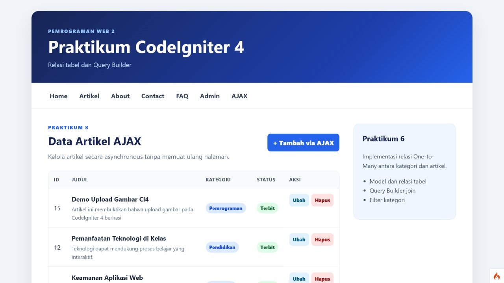

---

# 5️⃣ Menambahkan Form Tambah dan Ubah AJAX

Satu form digunakan untuk dua operasi. Jika ID kosong, data dikirim dengan method `POST`.
Jika ID terisi dari tombol **Ubah**, data dikirim dengan method `PUT`.

```javascript
const id = $('#artikelId').val();

$.ajax({
    url: id ? `${urls.update}/${id}` : urls.create,
    method: id ? 'PUT' : 'POST',
    data: $('#ajaxArtikelForm').serialize(),
    dataType: 'json'
});
```

## Screenshot

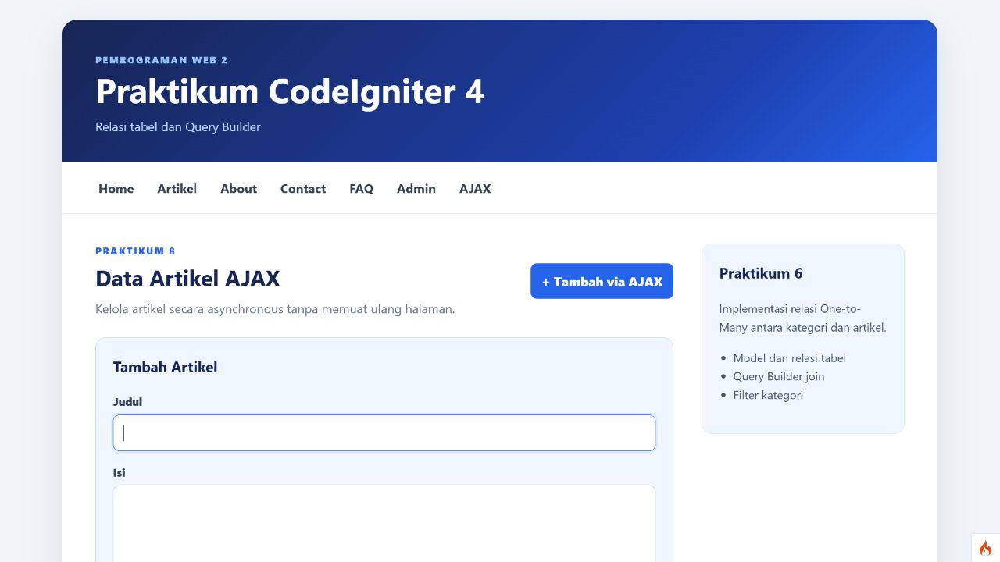

---

# 6️⃣ Menambahkan Hapus Data AJAX

Tombol hapus menampilkan konfirmasi, lalu mengirim request `DELETE`. Setelah server
memberikan response berhasil, fungsi `loadData()` dipanggil kembali agar tabel langsung
menampilkan data terbaru tanpa reload halaman penuh.

---

# 7️⃣ Keamanan dan Penanganan Error

Implementasi AJAX dilengkapi dengan:

- filter autentikasi pada seluruh endpoint;
- validasi server-side untuk judul, isi, kategori, dan status;
- response HTTP `404` untuk artikel yang tidak ditemukan;
- escaping data sebelum dimasukkan ke HTML untuk mencegah XSS;
- pesan sukses atau error yang diperbarui secara asynchronous;
- pembersihan file gambar jika artikel bergambar dihapus melalui AJAX.

---

# 8️⃣ Hasil Pengujian

| Pengujian | HTTP | Hasil |
|---|---:|---|
| Membuka halaman AJAX | `200` | Berhasil |
| Mengambil data JSON | `200` | Berhasil |
| Mengirim data tidak valid | `422` | Berhasil ditolak |
| Menambah artikel | `201` | Berhasil |
| Mengubah artikel dengan PUT | `200` | Berhasil |
| Menghapus artikel dengan DELETE | `200` | Berhasil |
| Memastikan record terhapus dari database | - | Berhasil |

Pengujian juga memastikan tabel terisi oleh JavaScript setelah halaman dibuka dan form
tambah dapat muncul tanpa navigasi ke halaman lain.

---

# 9️⃣ Perbaikan Screenshot README

Audit seluruh link gambar pada README menemukan dua referensi lama yang tidak memiliki
file. Link tersebut diperbaiki menjadi:

- `screenshots/spark-routes-p3.png` untuk screenshot route artikel;
- `screenshots/spark-server-p3.png` untuk screenshot server Praktikum 3.

Setelah perbaikan, semua path screenshot pada README memiliki file yang sesuai dan
kapitalisasi nama yang tepat untuk GitHub.

---

# ✅ Kesimpulan Praktikum 8

Pada praktikum ini berhasil dibuat halaman pengelolaan artikel menggunakan AJAX dan
jQuery. Data dapat diambil, ditambah, diubah, dan dihapus secara asynchronous. Response
JSON, validasi, status HTTP, autentikasi, dan escaping output membuat implementasi lebih
aman serta mudah di-debug.

---

# Praktikum 9 - AJAX Pagination dan Search

# Tujuan Praktikum

1. Membuat pagination artikel yang berjalan secara asynchronous.
2. Menambahkan live search dan filter kategori tanpa reload halaman.
3. Menambahkan sorting artikel berdasarkan ID, judul, kategori, atau status.
4. Memberikan loading indicator dan informasi jumlah data untuk pengalaman pengguna yang lebih baik.

---

# 1. Memperbarui Controller Artikel

Method `admin_index()` pada `app/Controllers/Artikel.php` menerima parameter berikut:

| Parameter | Fungsi |
|---|---|
| `q` | Mencari judul artikel |
| `kategori_id` | Memfilter kategori |
| `page` | Menentukan halaman aktif |
| `sort` | Menentukan kolom sorting |
| `direction` | Menentukan arah `ASC` atau `DESC` |

Kolom sorting dipetakan melalui whitelist agar nama kolom yang dikirim pengguna tidak
langsung dimasukkan ke query. Query tetap menggunakan relasi kategori dan pagination
CodeIgniter:

```php
$artikel = $model->paginate(10, 'artikel', $page);

if ($this->request->isAJAX()) {
    return $this->response->setJSON([
        'status'  => 'OK',
        'artikel' => $artikel,
        'filters' => $filters,
        'pager'   => $pagerData,
    ]);
}
```

Request biasa tetap menampilkan view HTML sebagai fallback, sedangkan request AJAX
menerima data artikel, filter aktif, dan metadata pagination dalam format JSON.

---

# 2. Membuat Pagination AJAX

View `app/Views/artikel/admin_index.php` memuat jQuery lokal dan mengirim request `GET`
ke `/admin/artikel`. Tabel serta tombol pagination dibuat ulang dari response JSON tanpa
reload halaman penuh.

```javascript
$.ajax({
    url: endpoint,
    method: 'GET',
    data: queryData(page),
    dataType: 'json',
    headers: { 'X-Requested-With': 'XMLHttpRequest' }
});
```

URL browser ikut diperbarui menggunakan `history.replaceState()`, sehingga filter dan
halaman aktif tetap terlihat pada query string.

## Screenshot

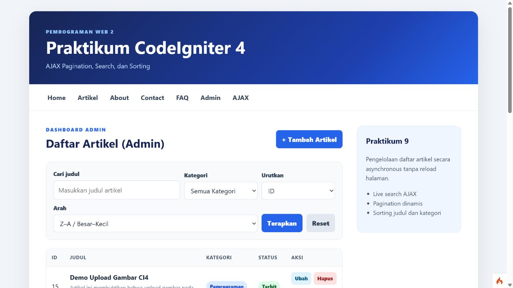

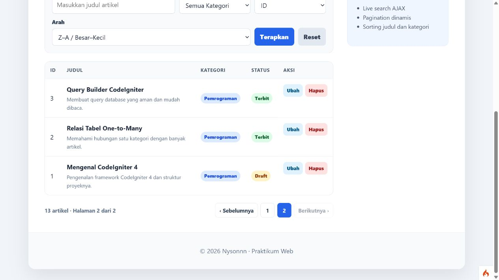

---

# 3. Menambahkan Live Search dan Filter Kategori

Input pencarian menggunakan debounce 350 milidetik agar request tidak dikirim pada setiap
penekanan tombol secara berlebihan. Perubahan kategori langsung memuat data baru dan
mengembalikan pagination ke halaman pertama.

Data artikel yang diterima selalu di-escape sebelum dimasukkan ke tabel untuk mencegah
HTML dari database dijalankan pada browser.

---

# 4. Menambahkan Sorting AJAX

Artikel dapat diurutkan berdasarkan:

- ID;
- judul;
- kategori;
- status;
- arah naik (`ASC`) atau turun (`DESC`).

Perubahan pilihan sorting langsung menjalankan request AJAX. Screenshot berikut
menunjukkan pencarian `CodeIgniter` yang diurutkan berdasarkan judul secara ascending.

## Screenshot

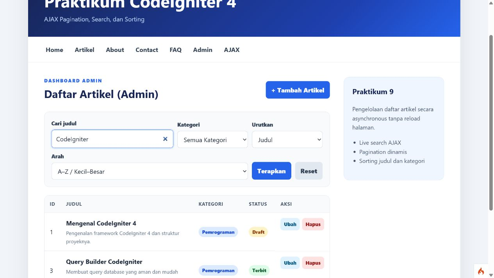


# 🔗 Repository GitHub

Tambahkan link repository GitHub di sini.

Contoh:

```bash
https://github.com/Nysonnn/Lab7Web
```

---

# 👨‍💻 Author

Nysonnn
